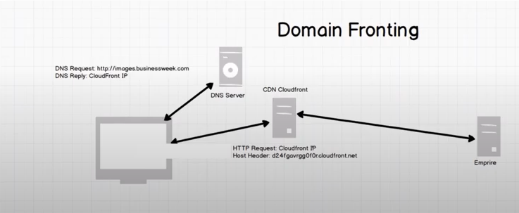

# C2 Helper Scripts & Tactics

## Domain Fronting

To have the ability to front a domain, you must have a domain that is on the same CDN network as yours AND you must include a host header to route the traffic within the CDN.

How to tell if you can use a domain for fronting:
* Do an `nslookup` to see if the CNAME is cloudfront

Headers to add if using AWS CloudFront: 
```
Host:<some_random_string>.cloudfront.net
```

It is important that if you do domain fronting, you use SSL because if not, the host header will be exposed and clever watchers will notice the mismatch between the host header and the actual request url

 https://www.youtube.com/watch?v=UTG3m-p-8ss

## HTTP Redirectors

### Potential Options

#### **Apache**

To make an Apache Server a redirector, you need to edit the `/var/www/.htaccess` file so you can use the `mod_rewite` module of Apache. An example of what the `.htaccess` file may look like below:

```
RewriteEngine On
RewriteCond %{HTTP_USER_AGENT} "Mozilla\/5..*6.1.*.7.*.11.*.Gecko.*.Edge.18.177"
RewriteRule ^.*$ https://172.31.9.119:443%{REQUEST_URI} [P]
RewriteRule ^.*$ https://www.google.com [L,R=302]
```

#### **CDN Network**

#### **SoCat**

To use socat, you just need to install socat and run a command like below:

```
sudo socat TCP4-LISTEN:80,fork TCP4:<your_ip_or_domain>:80
```

### Testing the Redirectors

A simple sanity check is to look at the web log on the c2 server and run a couple of test...

* Go to your browser and hit your redirector and check if it made it to your c2
* 