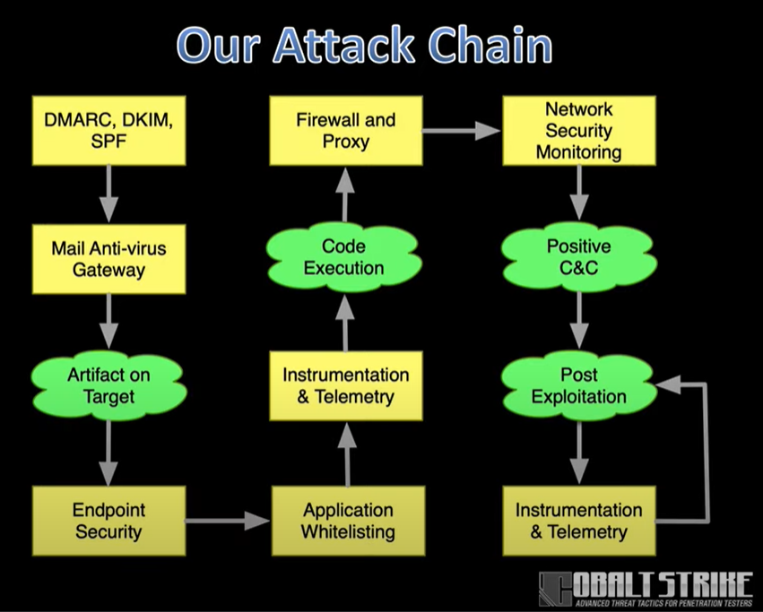
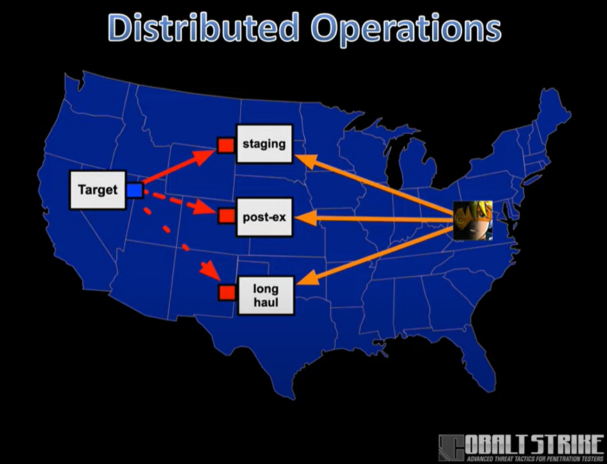
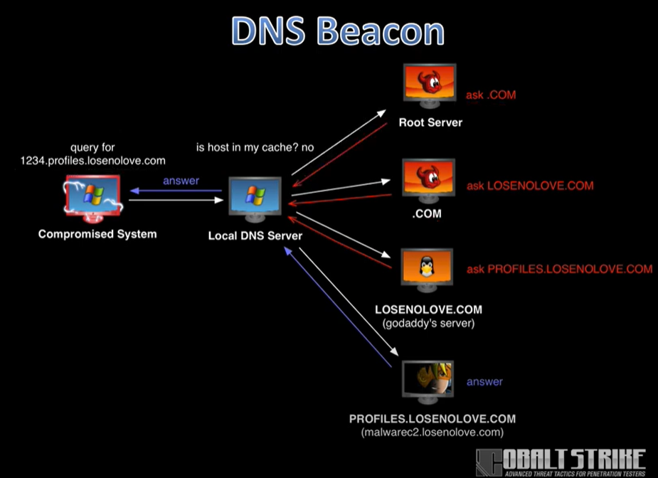
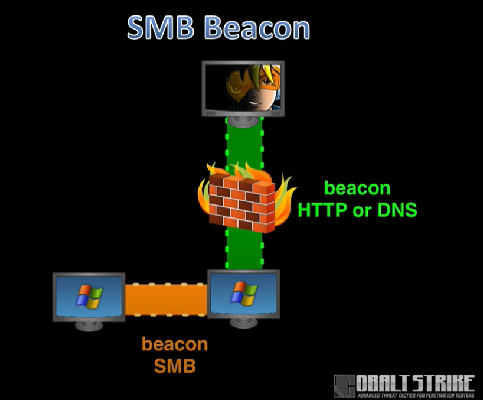

# Cobalt Strike Notes

Items to research more:
* MSF Staging Protocol

**_Table of Contents_**:
1) [Operations](https://github.com/ezra-buckingham/tool-notes/blob/main/cobalt-strike/cobalt-strike.md#1-operations)
2) [Infrastructure](https://github.com/ezra-buckingham/tool-notes/blob/main/cobalt-strike/cobalt-strike.md#2-infrastructure)
3) [C2](https://github.com/ezra-buckingham/tool-notes/blob/main/cobalt-strike/cobalt-strike.md#3-c2-command-and-control)
4) [Weponization](https://github.com/ezra-buckingham/tool-notes/blob/main/cobalt-strike/cobalt-strike.md#4-weponization)
5) [Initial Access](https://github.com/ezra-buckingham/tool-notes/blob/main/cobalt-strike/cobalt-strike.md#5-initial-access)
6) [Post Exploitation](https://github.com/ezra-buckingham/tool-notes/blob/main/cobalt-strike/cobalt-strike.md#6-post-exploitation)
7) [Priviledge Escalation](https://github.com/ezra-buckingham/tool-notes/blob/main/cobalt-strike/cobalt-strike.md#7-priviledge-escalation)
8) [Lateral Movement](https://github.com/ezra-buckingham/tool-notes/blob/main/cobalt-strike/cobalt-strike.md#8-lateral-movement)
9) [Pivoting](https://github.com/ezra-buckingham/tool-notes/blob/main/cobalt-strike/cobalt-strike.md#9-pivoting)

**_Overview_**:

This tool is not a magic wand to every scenario and remember that you must always be considering evasion tactics (you MUST know your tools and the best option to evade) as there are so many different monitoring solutions as well as teams on networks that defend against APT groups. 

**_Architecture for Cobalt Strike_**:

Has a team server (runs on linux) and a client tool. All the client tools can connect to the team server and that team server will contain all tools needed.

**_Reason for Cobalt Strike_**:

Create relevant and credible adversary simulations that:
* Create battle hardened security analysts that can approach any attack
* Drive objective and meaningful security advances
* Educate security professionals and decision makers on advanced threat tactics

**_Basic Usage_**

Starting the team server: `./teamserver <ip address of machine> <password>`

Starting the client: `./cobaltstrike`

Notes:
* The IP address is where you will be able to access the team server

**_Tools Within Cobalt Strike_**:
* **Beacon**
  * Cobalt Strike's Payload
  * Two comunication strategies
    * Async (low and slow)
    * Interactive (real time control)
  * Uses HTTP/S or DNS to egress a network
  * Uses SMB or TCP for p2p c2
  * Remote admin tool features

* **Malleable C2**
  * A domain-specific language to give you control over the indicators in the Beacon payload
    * Network traffic
    * In-memory content, characteristics, and behavior
    * Process injection behavior

* **Aggressor Script**
  * Scripting language built into CS that allows you to modify and extend the Cobalt Strike client

* **Logging**
  * Everything gets logged in on the team server (see `logs/` folder)

* **Reporting**
  * You can generate reports that help train blue team
    * Examples: Indicators of Compromise, Activity Report, Sessions Report, & Tactics/Techniques/Procedures Report
  * Found in the "Reporting" menu
  * You can even merge data from multiple team servers (with clock correction)
-------------

## 1) Operations

### Distributed Operations
There is a concept of "distributed operations" in which there are multiple team servers running that have different objectives and none of them know about each other. 

_Why would we do this?_ 

You do not want a single point of failure during operations.

_What does this mean?_
* You can connect to multiple team servers at once
* You can rename each server so that you know exactly what server does what
* Once connecting to a new server, you get a toolbar at the very bottom allowing you to toggle between servers quickly

_Best Practices for Infrastructure_
* Staging Servers
  * Host client-side attacks and inital callbacks
  * Inital priviledge escalation
  * Expect these servers to be caught... _quickly_
* Post-Exploitation Servers
  * Post-exploitation and lateral movement
* Long Haul Servers
  * "Low and Slow" persistent callbacks
  * Pass access to post-exploitation as needed
  * This is your lifeline should your other servers get caught

### Scaling Red Operations

The best way to scale operations is to split into Target cells and Access Management Cells. You do this because it is important to manage all your access in one spot reliably.

**Potential Team cells to organize your team for Scalability**

_Target Cells_
* Responsible for objectives on specific networks
* Gain access, post-exploitation, and spread latterally
* MAintain local infrastructure these tasks

_Access Management Cell_
* Holds accesses for all networks
* Gain access and recieve access from cells
* Pass accesses to target cells as needed
* Maintain global infrastructure for persistent cells

**Potential Team Roles for Scalability**

_Access_
* Get in and expand foothold

_Post Exploitation_
* Data mining, monitor users, key log, etc 

_Local Access Manager (Shell Sherpa)_
* Manage callbakcs
* Setup infra
* Persistence
* Pass sessions to and from global access manager

-------------

## 2) Infrastructure

### Listener Management
What is a listener?
* A configuration for a cobalt strike payload (and payload server)
* Different types of listeners
  * Egress - a payload the beacons out of a network
  * Peer-to-peer - a payload that communicates through a parent payload
  * Alias - a reference to a payload handler elsewhere (eg in another toolset)
* Manage using Cobalt Srike > Listeners

### Beacon Payloads
_Payload Staging_
* What is stager?
  * A tiny program that downloads a payload and passes execution to it (needed for size-constrained attacks)
  * Based on Metasploit framework staging protocol 
* Stageless means payload without a stager
* Stagers are (most of newer versions of Cobalt rely less on these):
  * Less secure
  * More brittle
  * Easier to detect

_HTTP/S Beacon_
* A Payload contained on the target machine that makes a GET request to the C2 server to get instructions for the payload to execute (in an enxrypted blob of data)
* The get request, if containing instructions for the HTTP beacon, will after completion of the tasks, will wespond with a POST request to the C2 server with the output (in an encrypted blob of data) from the tasks
* When configuring one, you can give a comma seperated list of callback hosts to callback many different hosts
  * Can give IPv4, IPv6, or a FQDN
  * Can also give a proxy config for the beacon
* Remember that only a single service can hold a single port so you cannot have a beacon on port 80 and a web server running at the same time

_DNS Beacon_
* Uses a DNS lookup to send back instructions to the beacon on tasks to complete
* This was used as a way to minimize the number of HTTP requests that are made to the C2 server (if no task was required, the beacon response from the A record DNS request would be 0.0.0.0, but if there were required tasks, the server would respond with an IP address to get from)
* Sometimes this inital A record request will work BUT then the HTTP request following will be blocked. You can get around this, by using the `mode [dns | dns6 | dns-txt]` in CS and retreiving tasks in smaller byte chunks at a time by making a bunch of A record requests and gaining access to the payload again

_DNS Beacon Set Up_
1. Edit Zone File for a domain you control
2. Create an A record for CS server
3. Create an NS record that points to FQDN of the CS server

_SMB Beacon_
* This beacon utilizes the named pipes funcationality for windows
* It uses a child beacon and a parent beacon (an egress beacon and peer-to-peer beacons)
* It uses the port 445 SMB protocol to communcate peer-to-peer
* You can see the lineage of beacons by going to Cobalt Strike > Visualization > Pivot Graph

_SMB Beacon Usage_
* You can link and unlink to a SMB beacon to keep your payload on the machine, but dormant
  * Link Beacon to peer `link [host] [pipe]`
  * De-link Beacon to peer `unlink [host] [pid]`
* You can also create a TCP p2p beacon and do the same as the SMB p2p beacon
  * Link Beacon to peer `connect [host] [port]`
  * De-link Beacon to peer ``unlink [host] [pid]`

_How to deliver the Beacon_
* It can deliver via a scripted web delivery in which Cobalt Strike will deliver a one-line script that will allow you pull the beacon over the web to the target

_Redirectors_
* You may use a redirector to obfuscate exactly where your team server is located
* You can do this by using iptables, socat, or other tool to forward traffic to your CS team server
  `socat TCP4-LISTEN:80,fork TCP4:[teamserver]:80`
* You can use Apache ot Nginx reverse proxy config
* You can use a CDN (ex. AWS Cloud Front) as a redirector for HTTPS traffic (called "domain fronting")
  * You will need to use a valid SSL certificate
  * Allow the HTTP POST and HTTP GET vers
  * Consider HTTP-GET only C2
  * Disable all cache options
  * Be aware of transformed requests! (changing cookie value)
  * Also this allows us to make the server look fully legit because a CDN is used by hundreds of legitimate companies
  * You can make the beacon override the requested host from "google.com" to "malicious.com"
    * Some proxy servers will normalize the data and not allow domain fronting to work as well as it used to
    * SSL will change this because it goes in an encrypted format and the proxy may not always be able to see that (only if the organization does man in the middle communication with the proxy will they catch the domain forwarding)

-------------

## 3) C2 (Command and Control)

-------------

## 4) Weponization

-------------

## 5) Initial Access

-------------

## 6) Post Exploitation

-------------

## 7) Priviledge Escalation

-------------

## 8) Lateral Movement

-------------

## 9) Pivoting